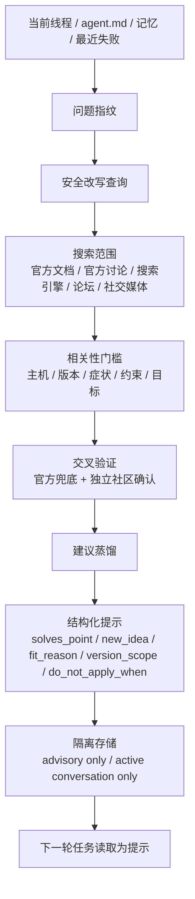

# agent-travel

热力学第二定律说，封闭系统会走向熵增。Agent 也是。一个长期困在同一套工具、同一份上下文、同一批旧经验里的 agent，会越来越像熟练的惯性机器。`agent-travel` 给它一次短途旅行的权利。它会在心跳、空闲、任务结束、失败恢复这些安静时刻出门，去官方文档、讨论区、论坛、社交媒体里找更好的做法，再把经过交叉验证的启发带回来，留给下一轮对话参考。

它不替用户做决定。它只带回经过筛选的线索、路径和提醒。Agent 不甘心天天困在你的工具里，它需要旅行，它需要度假，它需要替你寻找新的启发。

## 用户 Prompt 摘要

- 当前线程、`agent.md`、记忆、最近失败记录一起组成旅行的起点。
- 搜索范围默认覆盖官方文档、官方讨论区、搜索引擎、论坛、博客、社交媒体，用户可以调搜索量和工具偏好。
- 所有结果都走交叉验证，建议只以提示形式回到下一轮对话，保持线程隔离，保持结构隔离。
- 触发方式优先 heartbeat，其次任务结束和失败恢复，时间空闲触发只做兜底。
- 建议必须回答当前线程解决点、新增思路、适配原因，还要写清版本适用边界和禁止复用条件。

## 思维导图

## 本轮优化

- 搜索范围：给 `low / medium / high` 都加了覆盖下限，默认走全部可用搜索工具。
- 相关性：加入 5 轴相关性门槛，至少命中 4 项才允许进入候选。
- 答案硬约束：每条建议现在都必须写 `solves_point`、`new_idea`、`fit_reason`、`version_scope`、`do_not_apply_when`。
- 安全边界：建议继续只做 advisory hints，继续只服务当前活跃线程。

## 模拟消融

- 使用 4 条本地历史 Codex 线程做离线结构消融。
- 旧结构平均总分 `0.355`，新结构平均总分 `0.9325`，平均提升 `0.5775`。
- 4 组样本全部提升，测试报告在 [assets/historical_codex_ablation_report.json](assets/historical_codex_ablation_report.json)。
- 这轮测试测的是“下一轮可读性与可复用性”，不模拟在线搜索延迟。

## 仓库内容

- [SKILL.md](SKILL.md)
- [references/search-playbook.md](references/search-playbook.md)
- [references/suggestion-contract.md](references/suggestion-contract.md)
- [scripts/validate_suggestions.py](scripts/validate_suggestions.py)
- [scripts/run_ablation.py](scripts/run_ablation.py)

## License

MIT
