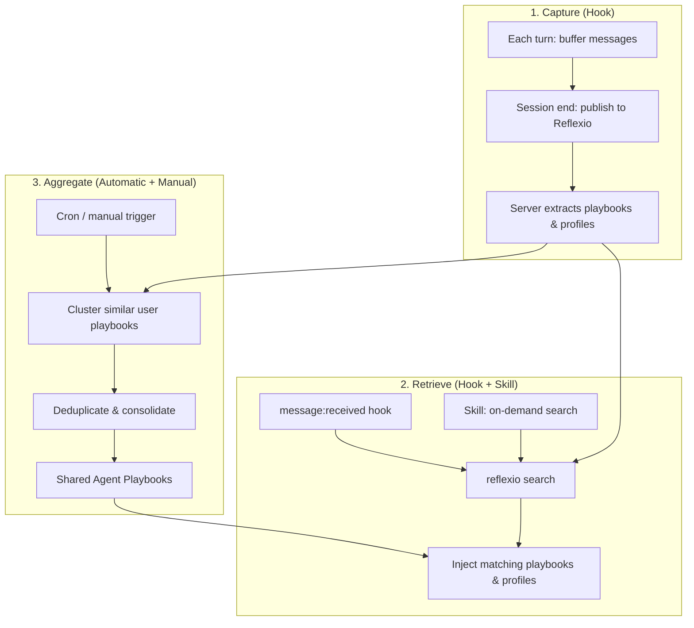

# Reflexio OpenClaw Integration

Connect [OpenClaw](https://openclaw.ai) agents to [Reflexio](https://github.com/reflexio-ai/reflexio) for automatic self-improvement with multi-user support and agent playbooks. Conversations are captured automatically; task-specific playbooks are retrieved on-demand via the `reflexio` CLI; and corrections from multiple agent instances are aggregated into shared agent playbooks.

## Table of Contents

- [How It Works](#how-it-works)
- [Multi-User Architecture](#multi-user-architecture)
- [Agent Playbooks](#agent-playbooks)
- [Prerequisites](#prerequisites)
- [Installation](#installation)
- [Configuration](#configuration)
- [Scheduled Aggregation](#scheduled-aggregation)
- [What to Expect](#what-to-expect)
- [File Structure](#file-structure)
- [Manual Testing](#manual-testing)
- [Comparison with Claude Code / LangChain Integrations](#comparison-with-claude-code--langchain-integrations)

## How It Works




The integration has three independent mechanisms:

### 1. Capture (Hook — automatic, runs every session)

```
Each Turn (message:sent)
  └── Buffer (user message, agent response) → local SQLite

Session End (command:stop)
  └── reflexio interactions publish → flush buffered turns to Reflexio server
      └── Server automatically:
          1. Detects learning signals (corrections, friction, re-steering)
          2. Extracts playbooks: freeform content summary + optional structured fields (trigger/instruction/pitfall/rationale)
          3. Extracts user profiles (preferences, expertise, communication style)
          4. Stores everything with vector embeddings for semantic search

Mid-Session (skill guidance)
  └── Skill guides agent to publish corrections and learnings at key steps
      └── Captures high-signal moments without waiting for session end
```

Correction detection happens **server-side via LLM** — the agent does not need to detect corrections itself.

### 2. Retrieve (Hook + Skill — automatic + on-demand)

```
Per-message (message:received hook — automatic)
  └── Hook injects reflexio search results before every agent response
      └── Returns user playbooks + agent playbooks relevant to the current message

Per-task (skill — on-demand)
  └── Agent runs reflexio search "<the user's actual task>"
      └── Semantic search matches query against playbook trigger fields
      └── Returns only playbooks relevant to THIS specific task
      └── Each result has a freeform summary (primary) + optional structured fields (trigger/instruction/pitfall)

Agent needs to personalize response
  └── reflexio user-profiles search "<what to know about the user>"
      └── Vector + FTS hybrid search on profile content
      └── Returns relevant user preferences, expertise, communication style
```

Both the hook injection and the per-task skill search return **user playbooks** (corrections specific to this agent instance) and **agent playbooks** (shared corrections aggregated from all instances).

Playbook retrieval is **per-task, not per-session**. Different tasks return different playbooks. The query is matched against the `trigger` field of stored playbooks using semantic search.

### 3. Aggregate (Automatic + Manual)

```
After each successful publish
  └── Aggregation runs in background automatically
      └── Clusters similar user playbooks across all agent instances
      └── Deduplicates and consolidates into shared agent playbooks
      └── New agent playbooks start as PENDING → reviewed → APPROVED/REJECTED

Manual trigger
  └── /reflexio-aggregate command  (OpenClaw slash command)
  └── reflexio agent-playbooks aggregate  (CLI)

Scheduled (recommended for teams)
  └── Cron job or systemd timer runs aggregation periodically
```

Agent playbooks accumulate corrections from all agent instances, so every instance benefits from corrections made by any other instance.

## Multi-User Architecture

Each OpenClaw agent (identified by its `agentId`) is treated as a distinct Reflexio user. This enables per-agent learning isolation alongside cross-agent shared learning:

```
~/.openclaw/
├── agents/
│   ├── main/        → Reflexio user_id: "main"
│   ├── work/        → Reflexio user_id: "work"
│   └── ops/         → Reflexio user_id: "ops"
```

- **User playbooks**: per-agent corrections, isolated by `agentId`. Mistakes made by `main` are tracked separately from mistakes made by `work`.
- **Agent playbooks**: shared corrections aggregated from ALL agents. Once a correction is aggregated and approved, every instance sees it via `reflexio search`.
- **`user_id`** is derived from the OpenClaw session key prefix (`agent:<id>:...`). There is no override — the hook is deliberately locked to sessionKey-derived identity to eliminate env-var reads.

## Agent Playbooks

Agent playbooks are the cross-instance knowledge layer. Individual corrections from each instance flow into a shared pool through aggregation:

```
Instance "main" corrections ─┐
Instance "work" corrections ──┤── Aggregation ──→ Shared Agent Playbooks
Instance "ops" corrections ───┘
```

- **Aggregation** clusters semantically similar user playbooks, deduplicates them, and consolidates them into a single agent playbook per distinct correction type.
- **Approval status**: new agent playbooks start as `PENDING`. They are surfaced in search immediately but can be reviewed and marked `APPROVED` or `REJECTED`.
- **All instances** receive agent playbooks alongside their own user playbooks via `reflexio search`.

This means a correction made once by any instance eventually prevents the same mistake across all instances.

## Prerequisites

- [OpenClaw](https://openclaw.ai) installed and running
- The `reflexio` CLI on PATH: `pipx install reflexio-ai` (or `pip install --user reflexio-ai`)
- The local Reflexio server running at `127.0.0.1:8081` (the hook starts it automatically if it's down)

**The Reflexio server requires an LLM API key** (e.g., `OPENAI_API_KEY`) in `~/.reflexio/.env` for playbook extraction — that key is read by the server process, never by this hook. Supported providers: OpenAI, Anthropic, Google Gemini, DeepSeek, OpenRouter, MiniMax, DashScope, xAI, Moonshot, ZAI.

> Run `reflexio setup openclaw` to automate LLM provider selection, storage configuration, and hook/skill/command installation.

## Installation

### Option 1 — ClawHub (recommended)

```bash
clawhub skill install reflexio
```

On first use, the skill auto-installs the `reflexio-ai` CLI (via `pipx` or `pip`) and runs `reflexio setup openclaw` to activate the hook, slash commands, and workspace rule.

### Option 2 — Automated setup (if you already have `reflexio-ai` installed)

```bash
pip install reflexio-ai
reflexio setup openclaw
```

This installs the hook, copies the skill and commands to `~/.openclaw/skills/`, and drops the workspace rule into `~/.openclaw/workspace/`.

### Option 3 — Manual (for developing against source)

```bash
# Hook: automatic capture + retrieval
openclaw hooks install /path/to/reflexio/integrations/openclaw/hook --link
openclaw hooks enable reflexio-context
openclaw gateway restart
openclaw hooks list  # expect: ✓ ready │ 🧠 reflexio-context

# Skill: teaches agent when/how to use reflexio CLI
cp -r /path/to/openclaw/skill ~/.openclaw/skills/reflexio

# Commands: publish corrections mid-session, trigger aggregation
cp -r /path/to/openclaw/commands/reflexio-extract ~/.openclaw/skills/reflexio-extract
cp -r /path/to/openclaw/commands/reflexio-aggregate ~/.openclaw/skills/reflexio-aggregate

# Rule: always-active behavioral constraints — loaded every session
cp /path/to/openclaw/rules/reflexio.md ~/.openclaw/workspace/reflexio.md
```

The rule ensures the agent follows injected Reflexio context, runs manual search fallback when the hook doesn't fire, and enforces behavioral conventions (transparency, non-blocking, silent infrastructure).

## Configuration

This integration is **localhost-only**. The hook hard-codes the Reflexio
server URL to `http://127.0.0.1:8081` and reads no environment variables —
it cannot be reconfigured to send data off-host. The agent label is hardcoded
to `openclaw-agent` and the per-agent user ID is derived from OpenClaw's
session key (`agent:<id>:...` prefix), with a fallback of `openclaw`.

If you need remote Reflexio (managed or self-hosted) from OpenClaw, use the
Claude Code integration instead — it supports a full set of env vars for
pointing at external servers.


## Scheduled Aggregation

For teams running many agent instances, schedule periodic aggregation so agent playbooks stay up to date:

```bash
# Aggregate every 6 hours (crontab -e)
0 */6 * * * reflexio agent-playbooks aggregate --agent-version openclaw-agent 2>> ~/.reflexio/logs/aggregation.log
```

**systemd timer** (Linux):

```ini
# ~/.config/systemd/user/reflexio-aggregate.service
[Service]
ExecStart=reflexio agent-playbooks aggregate --agent-version openclaw-agent

# ~/.config/systemd/user/reflexio-aggregate.timer
[Timer]
OnCalendar=*-*-* 00/6:00:00
Persistent=true
```

If OpenClaw supports scheduled tasks natively, you can also register aggregation as a recurring OpenClaw task to keep everything within the same scheduler.

## What to Expect

**Session 1 (cold start):** No playbooks exist yet. The agent works normally. At session end, the hook captures the full conversation. Reflexio's server-side LLM pipeline analyzes it and extracts any corrections or user preferences.

**Session 2+:** Before each task, the agent runs `reflexio search "<task>"` and gets task-specific corrections from past sessions — both user playbooks (corrections from this agent instance) and agent playbooks (corrections shared across all instances). Over time:

- Mistakes made once are not repeated (corrections match by trigger similarity)
- User preferences are remembered (profiles extracted automatically)
- The agent adapts its approach per-task based on accumulated playbooks
- Corrections from one agent instance propagate to all instances via aggregation

**The learning loop:**

1. Agent works on a task → user corrects a mistake
2. Session ends → hook captures full conversation → server extracts user playbooks
3. Next session, similar task → agent searches → gets the correction → applies the behavioral guideline
4. Mistake not repeated
5. Aggregation runs → correction promotes to agent playbook → all other instances benefit too

## File Structure

```
openclaw/
├── README.md               ← This file
├── hook/                   ← Automatic: capture conversations + inject search results
│   ├── handler.js          ← Event handlers: bootstrap, message:received, message:sent, command:stop
│   ├── HOOK.md             ← Hook metadata (events, requirements)
│   └── package.json        ← npm package manifest
├── skill/                  ← On-demand: search for task-specific playbooks + publish
│   └── SKILL.md            ← Teaches agent when/how to search, publish, and aggregate
├── rules/                  ← Always-active: behavioral constraints loaded every session
│   └── reflexio.md         ← Follow injected context, manual search fallback, transparency
└── commands/               ← OpenClaw slash commands
    ├── reflexio-extract/   ← /reflexio-extract: publish corrections mid-session
    └── reflexio-aggregate/ ← /reflexio-aggregate: trigger aggregation manually
```

## Manual Testing

See [TESTING.md](TESTING.md) for a step-by-step guide to manually test the integration end-to-end — from install through search, capture, retrieval, multi-user isolation, graceful degradation, and uninstall.

## Comparison with Claude Code / LangChain Integrations


| Aspect               | OpenClaw                                       | Claude Code                                    | LangChain                               |
| -------------------- | ---------------------------------------------- | ---------------------------------------------- | --------------------------------------- |
| Integration method   | CLI commands + hooks                           | CLI commands + hooks                           | Python SDK + callbacks                  |
| Context retrieval    | Per-message (hook) + per-task (skill)          | Per-task via skill                             | Per-LLM-call via middleware (automatic) |
| Conversation capture | Hook buffers → SQLite → flushes at session end | Hook buffers → SQLite → flushes at session end | Callback captures per chain run         |
| Multi-user support   | Yes — per-agentId user isolation               | Yes — per-agent user isolation                 | Single user per client instance         |
| Agent playbooks      | Yes — aggregated across all instances          | Yes — aggregated across all instances          | Not yet                                 |
| Agent teaching       | SKILL.md (natural language)                    | SKILL.md (natural language)                    | Tool definition (structured)            |
| Dependencies         | `reflexio` CLI only                            | `reflexio` CLI only                            | `langchain-core >= 0.3.0`               |


All integrations connect to the same Reflexio server and share the same playbook/profile data. Agent playbooks aggregated from OpenClaw instances are visible to Claude Code agents, and vice versa, as long as they use the same `--agent-version` tag.

## Further Reading

- [Reflexio main README](../../../../README.md)
- [Python SDK documentation](../../../client_dist/README.md)

